# EE 542 Lab 3 Report

## Part 1 — AWS Network Performance Experiments

### 1. AWS Network Topology

#### 1.1 VPC and Subnets

| Purpose | Subnet |
|---|---|
| Client experimental network | `10.0.1.0/24` |
| Server experimental network | `10.0.2.0/24` |
| Client SSH/EIP network | `10.0.3.0/24` |
| Server SSH/EIP network | `10.0.4.0/24` |

#### 1.2 EC2 Instances

| Node | Interface | Private IP | Purpose |
|---|---|---:|---|
| Client | experimental interface | `10.0.1.91` | Client–VyOS traffic |
| Client | SSH interface | `10.0.3.39` | Elastic IP / SSH |
| VyOS | eth0 | `10.0.1.173` | Client-side routing |
| VyOS | eth1 | `10.0.2.221` | Server-side routing |
| Server | experimental interface | `10.0.2.177` | Server–VyOS traffic |
| Server | SSH interface | `10.0.4.136` | Elastic IP / SSH |

---

### 2. AWS Architecture and Concepts

A VPC is an isolated virtual network, and subnets divide its address space into separate network segments. An Internet Gateway connects the VPC to the Internet. Route tables determine where subnet traffic is forwarded. Security groups are stateful filters for instances and ENIs, while Network ACLs are stateless filters applied to subnets. An ENI is a virtual network interface with private IP addresses and security groups. An Elastic IP is a public address mapped by AWS to a private IP on an ENI. The Client and Server used separate NICs for experimental traffic and SSH/Internet access. AWS source/destination checking requires an instance to be the source or destination of traffic passing through its ENI. It was disabled on VyOS because the router forwards packets between other hosts.

---

### 3. Routing Configuration

Client traffic to the Server network was routed through VyOS:

```bash
sudo ip route add 10.0.2.0/24 via 10.0.1.173 dev ens5
```

Server traffic to the Client network was routed through VyOS.

```bash
sudo ip route add 10.0.1.0/24 via 10.0.2.221 dev ens5
```

---

### 4. Connectivity Verification

Client-to-Server connectivity was tested using:

```bash
ping 10.0.2.177
```

Traffic forwarding through VyOS was verified with:

```bash
sudo tcpdump -ni eth0 icmp
sudo tcpdump -ni eth1 icmp
```

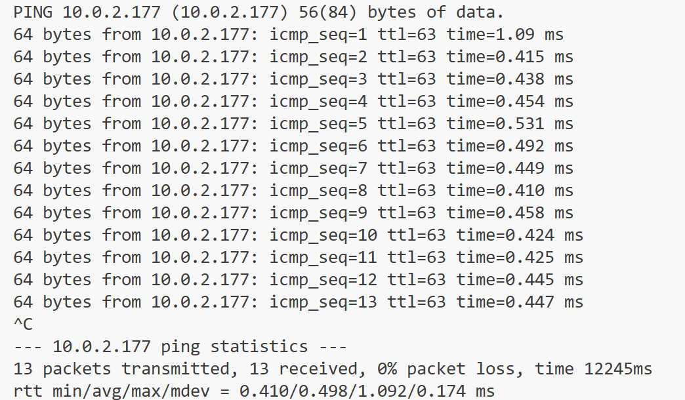

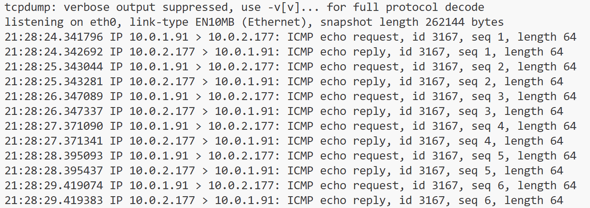

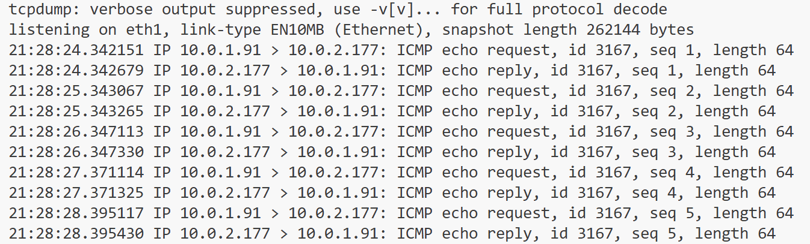

**Result:** 13/13 pings succeeded (0% loss); RTT min/avg/max = 0.410/0.498/1.092 ms. Both VyOS interfaces captured the ICMP requests and replies, confirming forwarding.

---

### 5. Baseline Performance

Server:

```bash
iperf3 -s
```

Client UDP test:

```bash
iperf3 -u -c 10.0.2.177 -b 500M
```

Client TCP test:

```bash
iperf3 -c 10.0.2.177
```

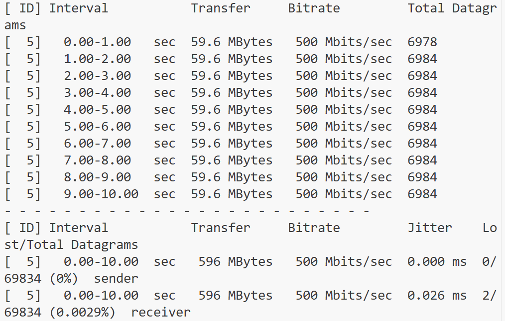

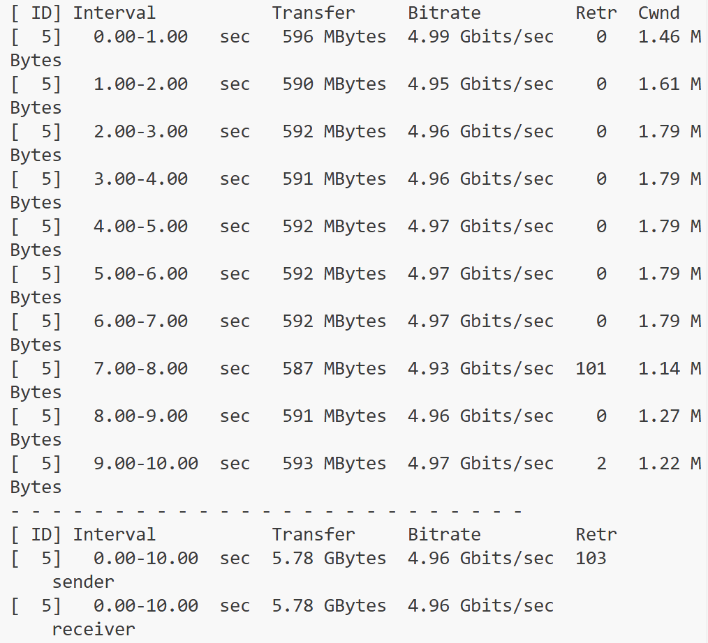

| Test | Throughput / Bandwidth | Notes |
|---|---:|---|
| UDP baseline | 500 Mbit/s (configured) | 596 MBytes transferred; 2/69,834 datagrams lost (0.0029%); jitter = 0.026 ms |
| TCP baseline | 4.96 Gbit/s | 5.78 GBytes transferred; 103 retransmissions |

The maximum throughput measured was 4.96 Gbit/s for TCP and 500 Mbit/s for UDP. The UDP result matched the configured `-b 500M` sending rate.

---

### 6. 100 ms Delay

A 100 ms delay was applied to `ens5` on both the Client and Server:

```bash
# Run on both VMs
sudo tc qdisc add dev ens5 root netem delay 100ms
```

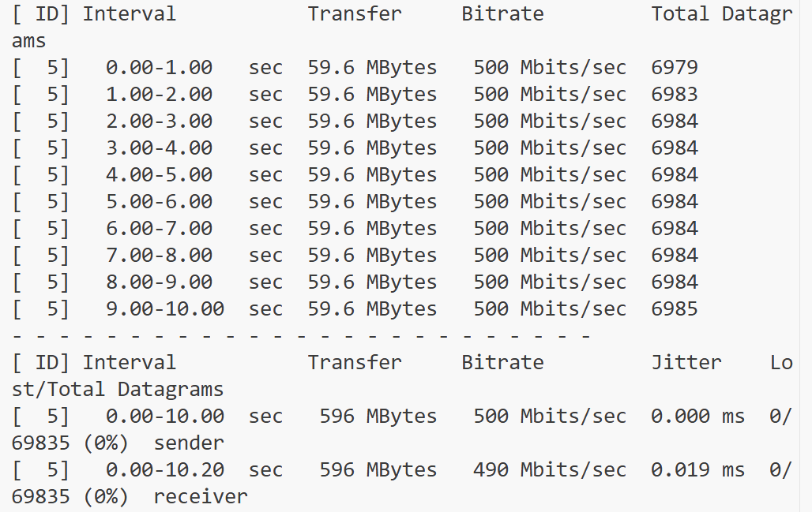

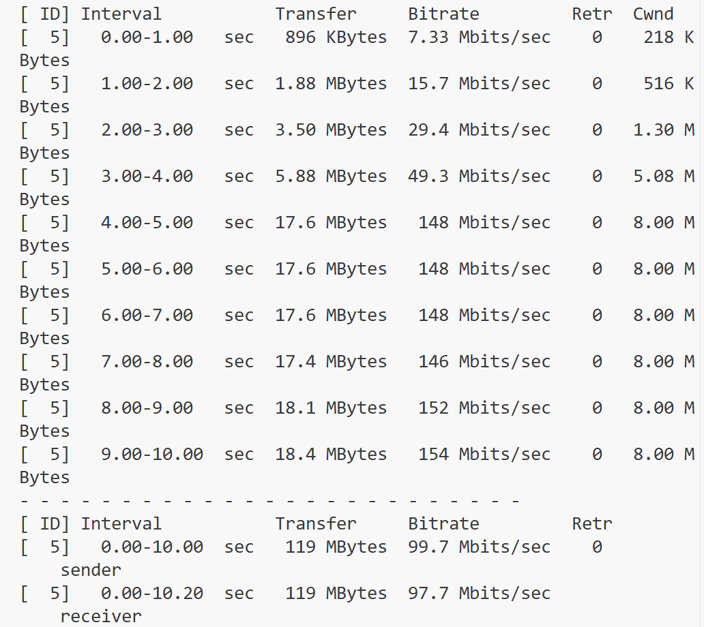

| Test | Result with 100 ms delay |
|---|---|
| UDP | 490 Mbit/s received; 0% loss; 0.019 ms jitter |
| TCP | 97.7 Mbit/s received; 0 retransmissions |

UDP stayed near its configured rate. Applying 100 ms in both directions added about 200 ms to the RTT and reduced TCP throughput.

---

### 7. 10% Packet Loss

The `ens5` interface on both the Client and Server was configured with 10% packet loss:

```bash
# Run on both VMs
sudo tc qdisc change dev ens5 root netem delay 0ms loss 10%
```

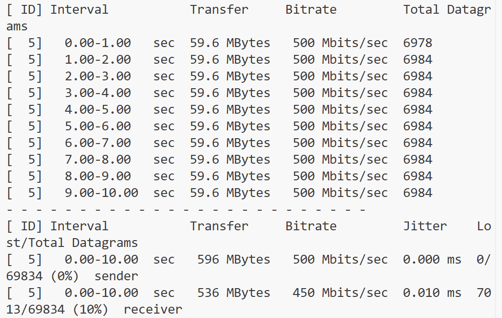

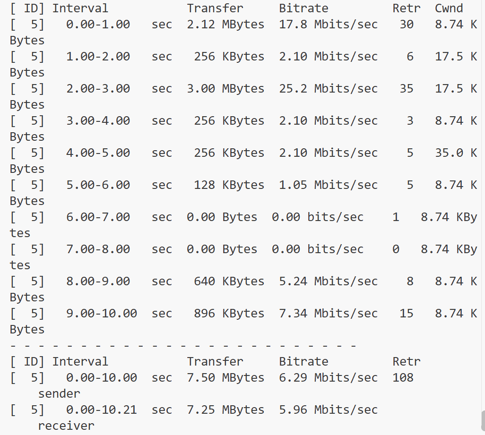

| Test | Result with 10% loss |
|---|---|
| UDP | 450 Mbit/s received; 7,013/69,834 lost (10%); 0.010 ms jitter |
| TCP | 5.96 Mbit/s received; 108 retransmissions |

UDP maintained its sending rate but lost packets. TCP throughput fell sharply because both data packets and ACKs were subject to loss.

---

### 8. Kernel Log and MTU

Kernel messages were monitored during the tests:

```bash
sudo dmesg -wH &
```

No relevant kernel errors were observed.

Interface MTU was checked using:

```bash
ip link show ens5
```

**MTU:** `9001` bytes on `ens5`. This jumbo MTU carries more data per packet, reducing packet rate and header/CPU overhead, which can improve throughput. If the path does not support it, packets may be fragmented or dropped. The MTU was inspected but not varied in this experiment.

---

### 9. 100 Mbit/s Rate Limiting

The previous qdiscs were removed from `ens5` on both the Client and Server:

```bash
# Run on both VMs
sudo tc qdisc del dev ens5 root
```

A Token Bucket Filter was then configured on the Client:

```bash
sudo tc qdisc add dev ens5 root tbf rate 100mbit latency 1ms burst 9015
```

`rate 100mbit` sets the average rate limit, `burst 9015` allows a short 9,015-byte burst, and `latency 1ms` limits how long packets may wait in the queue.

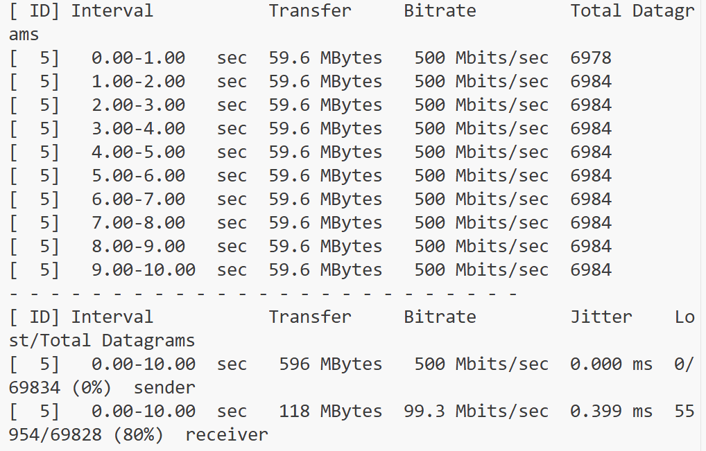

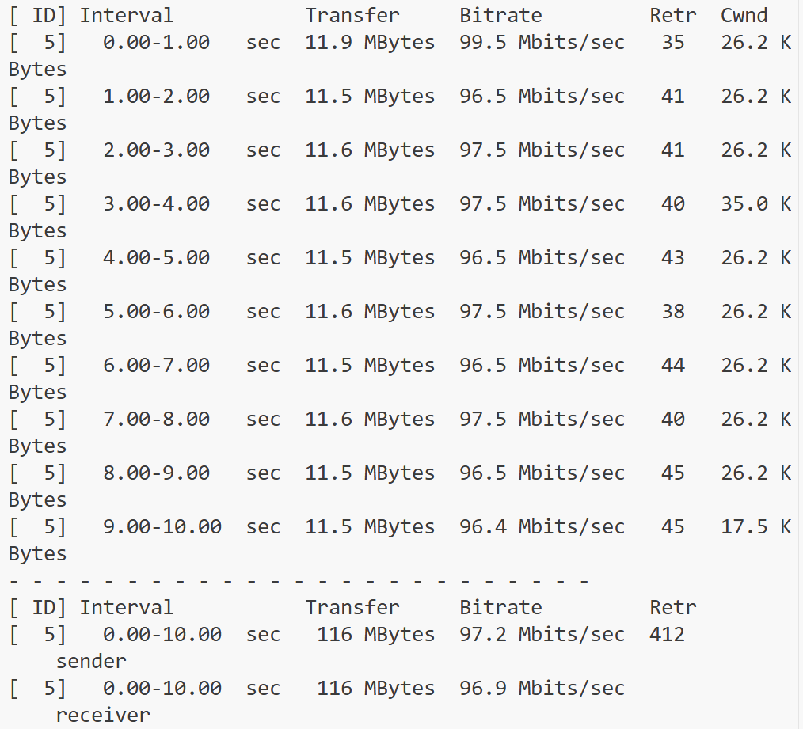


| Test | Receiver throughput | Other result |
|---|---:|---|
| TCP | 96.9 Mbit/s | 412 retransmissions |
| UDP | 99.3 Mbit/s | 55,954/69,828 lost (80%); 0.399 ms jitter |

The 100 Mbit/s TBF capped both flows near 100 Mbit/s. The UDP sender still transmitted at 500 Mbit/s, so excess packets were dropped.

---

### 10. ethtool Test

The following command was tested:

```bash
sudo ethtool -s ens5 speed 10
```

**Observed error/result:**  
`netlink error: Operation not supported`

**Explanation:** AWS exposes a virtual NIC; its link speed is managed by the platform and cannot be changed with `ethtool` from the guest OS.

---

### 11. Experiments on VyOS

The previous `tc` configurations were removed from the Client and Server.

The experiments were repeated with the same impairment values on VyOS `eth1`, which was not associated with an Elastic IP. Unlike the two-VM tests, this affected only traffic leaving `eth1`.


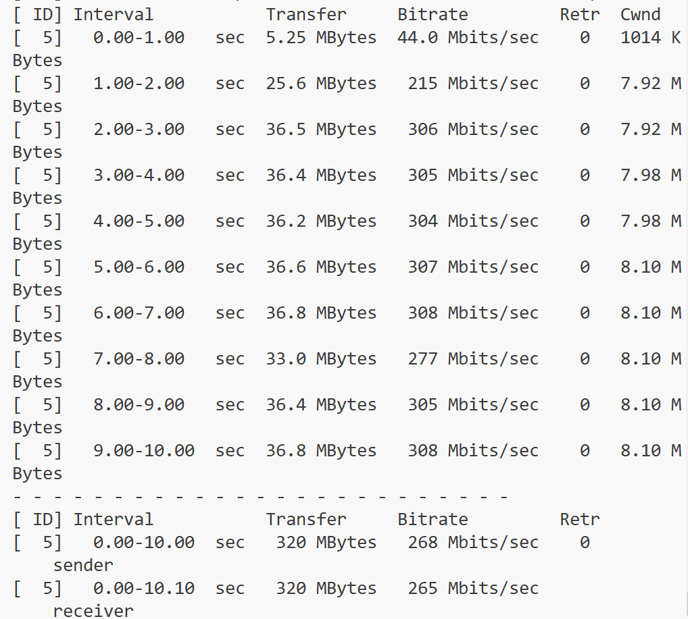

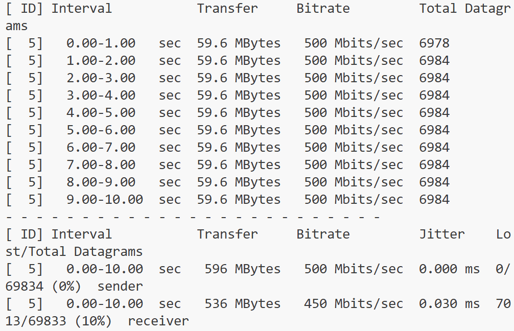

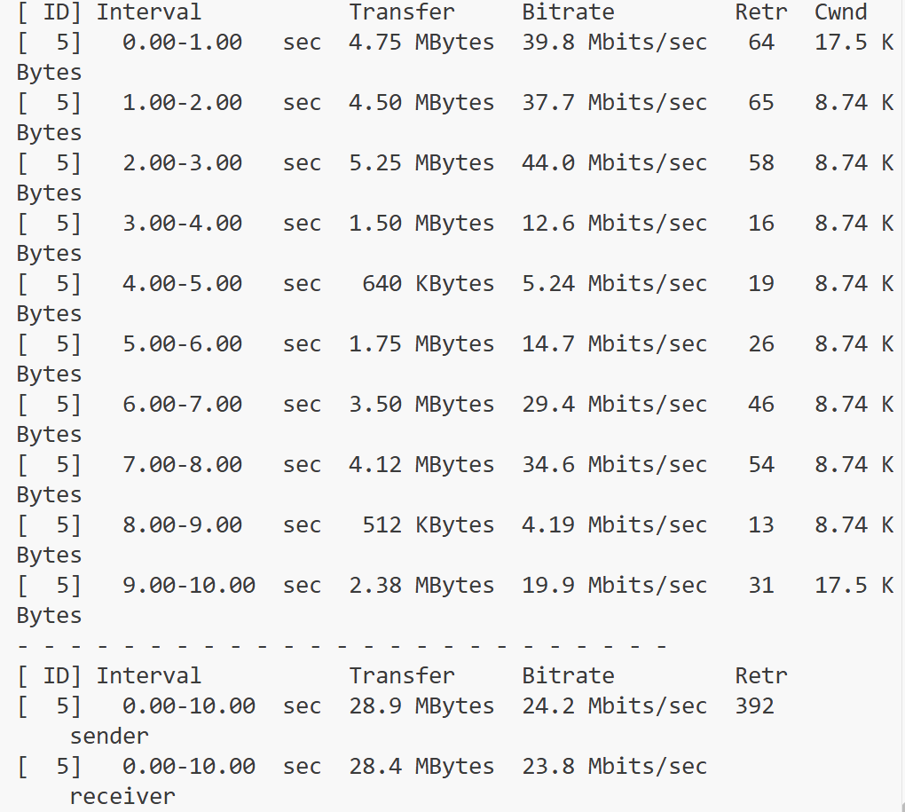

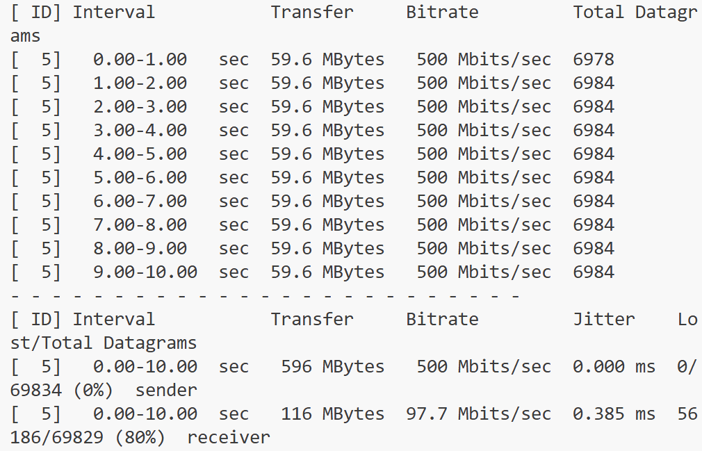

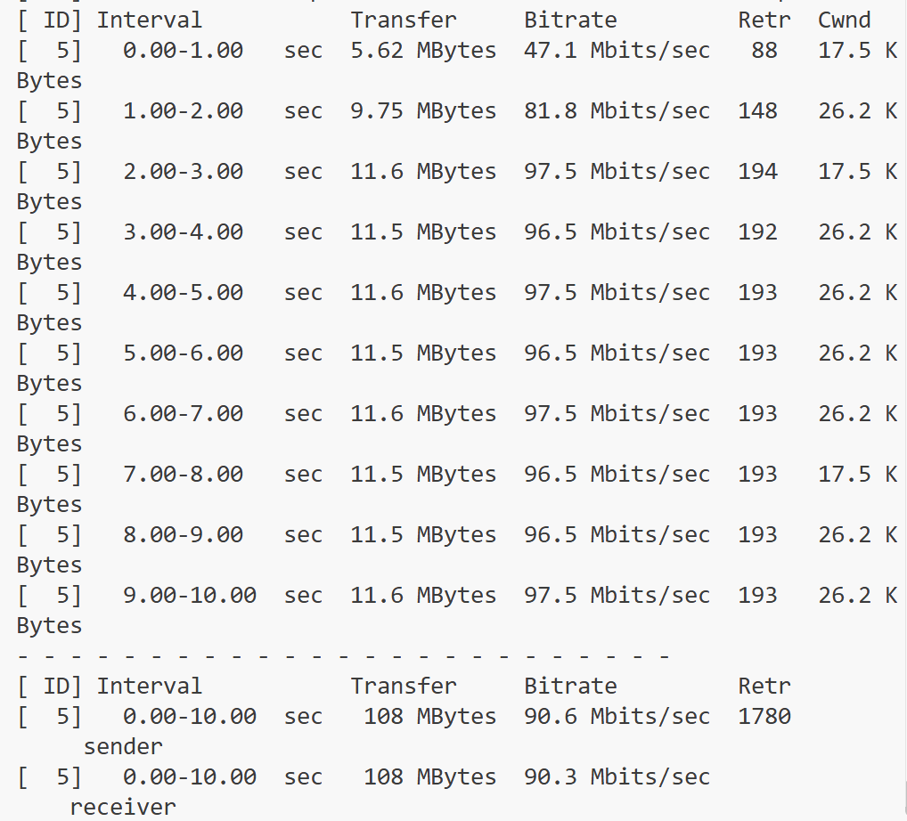

| Configuration | UDP receiver result | TCP receiver result |
|---|---|---|
| 100 ms delay | 494 Mbit/s; 119/69,834 lost (0.17%); 0.015 ms jitter | 265 Mbit/s; 0 retransmissions |
| 10% loss | 450 Mbit/s; 7,013/69,833 lost (10%); 0.030 ms jitter | 23.8 Mbit/s; 392 retransmissions |
| 100 Mbit/s TBF | 97.7 Mbit/s; 56,186/69,829 lost (80%); 0.385 ms jitter | 90.3 Mbit/s; 1,780 retransmissions |

VyOS produced the same overall behavior: delay reduced TCP throughput, loss caused retransmissions, and TBF capped throughput. Results differed because only one egress interface was impaired.

---

### 12. Discussion Questions

#### How can DHCP be started or configured on VyOS?

For a persistent configuration, use `configure`, `set interfaces ethernet eth0 address dhcp`, `commit`, and `save`. A temporary DHCP client can be started with `sudo dhclient eth0`. In this experiment, no manual DHCP step was recorded because the VyOS interfaces already had their AWS-assigned private addresses.

#### Why does SSH disconnect if the IP/interface used by the Elastic IP is changed?

The Elastic IP is associated with one ENI/private IP. Changing that interface or IP breaks the existing SSH path, so the session disconnects.

#### How does AWS map a public Elastic IP to a private interface IP?

AWS maps the public Elastic IP to the ENI's private address using one-to-one NAT.

#### Why could the VMs not initially access the Internet, and how was it fixed?

The Internet route was available through the SSH/EIP interface, but DNS resolution was not configured correctly. A DNS server was added to `/etc/resolvconf/resolv.conf.d/base`, and the resolver configuration was regenerated:

```bash
# Add this line to /etc/resolvconf/resolv.conf.d/base
nameserver 8.8.8.8
sudo resolvconf -u
```

After DNS resolution worked, `sudo apt update` downloaded the latest package indexes. It did not install package upgrades.

#### Why can TCP and UDP show different throughput on the same link?

UDP sends at the configured rate without recovery. TCP adapts its rate and retransmits when packets are lost.

#### Why is changing NIC speed with `ethtool` not supported in AWS?

The NIC is virtual hardware controlled by AWS, not a physical adapter whose speed the guest can set.

---

### 13. Conclusion

The Client–VyOS–Server topology forwarded traffic successfully with 0% ping loss. Baseline TCP reached 4.96 Gbit/s; 100 ms delay and 10% loss greatly reduced TCP throughput, while TBF limited both TCP and UDP receiver throughput to about 100 Mbit/s.

# Part 2 — Fast and Reliable File Transfer in the Cloud

## 1. Test Setup

The sender transferred a 1 GiB file using the Lab 2 reliable-UDP program with an 8,192-packet window. MTU 1500 used a 1,400-byte payload and MTU 9001 used an 8,900-byte payload. `iperf3` and `ping` were run as reference measurements.

The three cases follow the Lab 2 target conditions: Case 1 uses 10 ms RTT, 1% loss per direction, and a 100 Mbit/s rate limit; Case 2 uses 200 ms RTT, 20% loss per direction, and a 100 Mbit/s rate limit; Case 3 uses 200 ms RTT, no random loss, 100 Mbit/s client/server limits, and an 80 Mbit/s router limit. UDP sending and file-transfer pacing were set to 95 Mbit/s for Cases 1–2 and 75 Mbit/s for Case 3. Ping loss is a round-trip measurement, whereas iperf3 UDP loss is measured in one direction.

## 2. Results

### Case 1 — Low-latency path (about 10–13 ms RTT)

| MTU | Ping loss / avg RTT | iperf3 UDP receiver | iperf3 TCP receiver | Reliable UDP transfer |
|---:|---|---|---|---|
| 1500 | 0% / 12.859 ms | 93.9 Mbit/s; 1.1% loss | 11.5 Mbit/s; 101 retransmissions | 97.527 s; 88.08 Mbit/s; 15,340 retransmissions |
| 9001 | 2.5% / 10.546 ms | 94.0 Mbit/s; 0.91% loss | 11.6 Mbit/s; 45 retransmissions | 91.288 s; 94.10 Mbit/s; 113 retransmissions |

Jumbo frames improved the reliable-UDP throughput by about 6 Mbit/s and substantially reduced retransmissions.

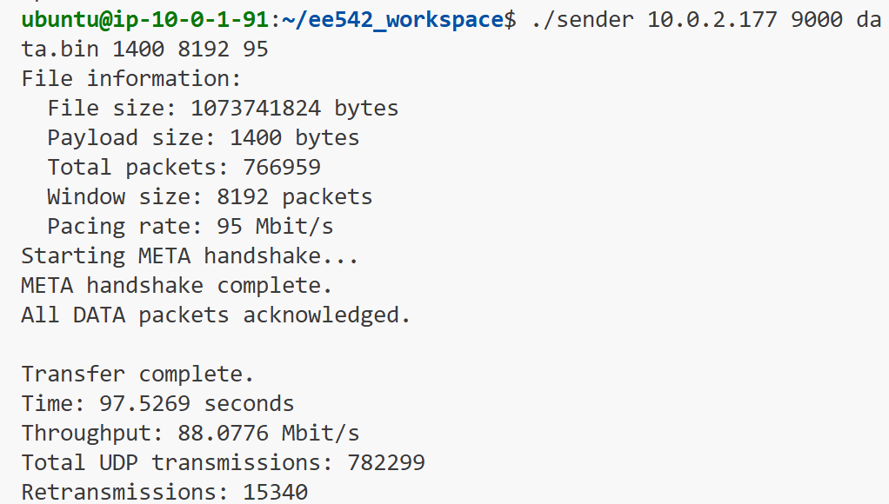

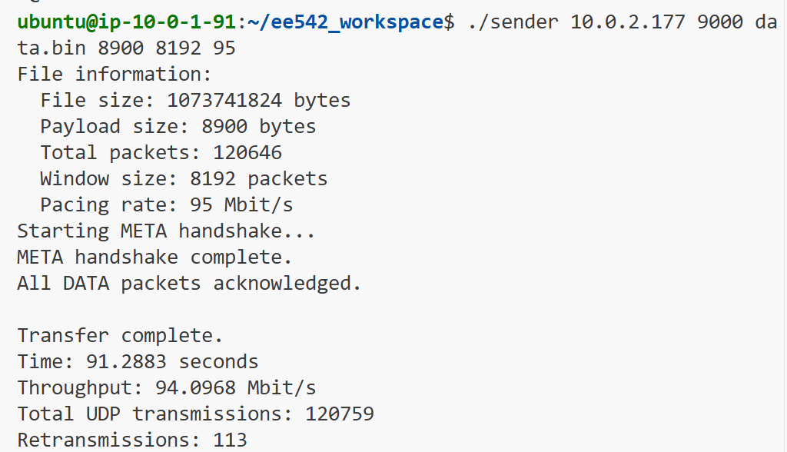

### Case 2 — High-delay, lossy path (about 200 ms RTT)

| MTU | Ping loss / avg RTT | iperf3 UDP receiver | iperf3 TCP receiver | Reliable UDP transfer |
|---:|---|---|---|---|
| 1500 | 40% / 200.587 ms | 62.1 Mbit/s; 21% loss | 52.5 Kbit/s; 17 retransmissions | 152.192 s; 56.44 Mbit/s; 430,572 retransmissions |
| 9001 | 30% / 200.564 ms | 74.5 Mbit/s; 20% loss | 206 Kbit/s; 25 retransmissions | 146.011 s; 58.83 Mbit/s; 68,045 retransmissions |

Loss and long delay severely reduced TCP performance. The reliable-UDP program completed in both MTU settings; MTU 9001 was faster and required fewer retransmissions, although its FIN handshake timed out three times.

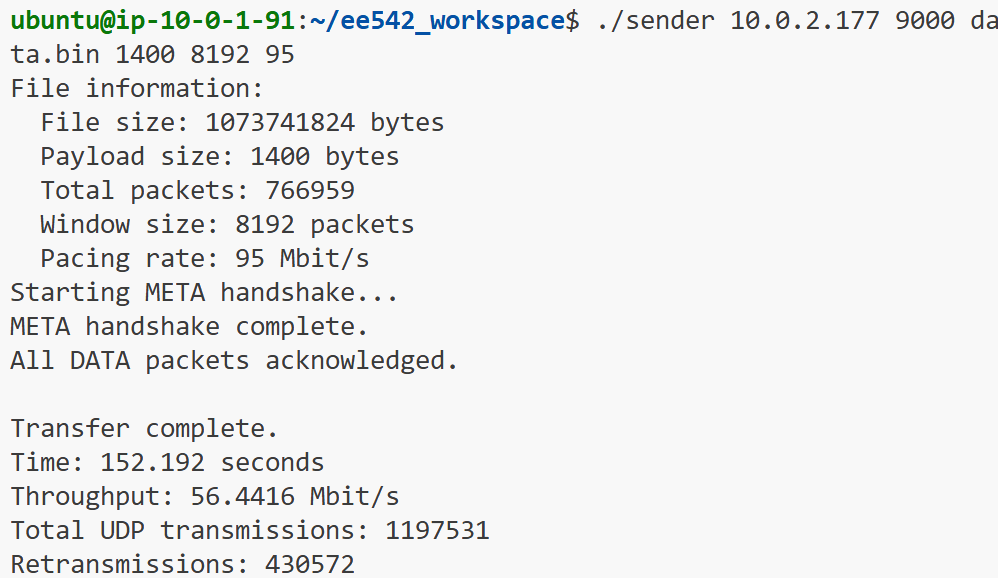

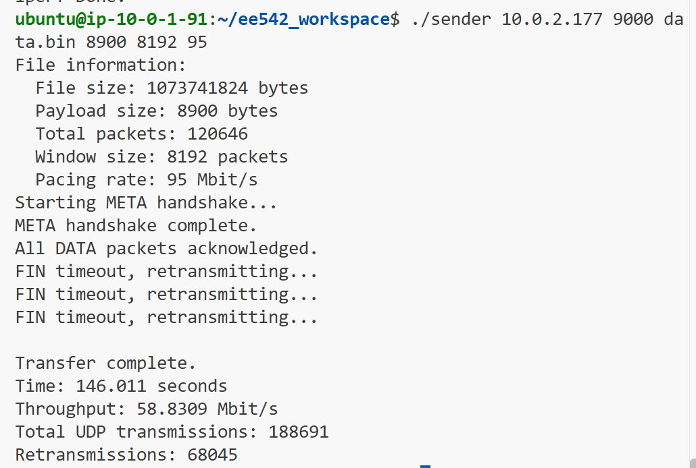

### Case 3 — High-delay, loss-free path (about 200 ms RTT)

| MTU | Ping loss / avg RTT | iperf3 UDP receiver | iperf3 TCP receiver | Reliable UDP transfer |
|---:|---|---|---|---|
| 1500 | 0% / 200.552 ms | 73.5 Mbit/s; 0% loss | 15.0 Mbit/s; 0 retransmissions | 120.838 s; 71.09 Mbit/s; 2 retransmissions |
| 9001 | 0% / 200.622 ms | 73.5 Mbit/s; 0% loss | 719 Kbit/s; 20 retransmissions | 116.318 s; 73.85 Mbit/s; 83 retransmissions |

With no measured UDP loss, receiver throughput was 73.5 Mbit/s, close to the configured 75 Mbit/s sending rate. The reliable-UDP transfer completed faster with MTU 9001. The 719 Kbit/s TCP result at MTU 9001 was caused by TBF queue behavior: jumbo packets consumed most of the available burst at once, causing extra queueing/drops and TCP retransmissions, which sharply reduced throughput.

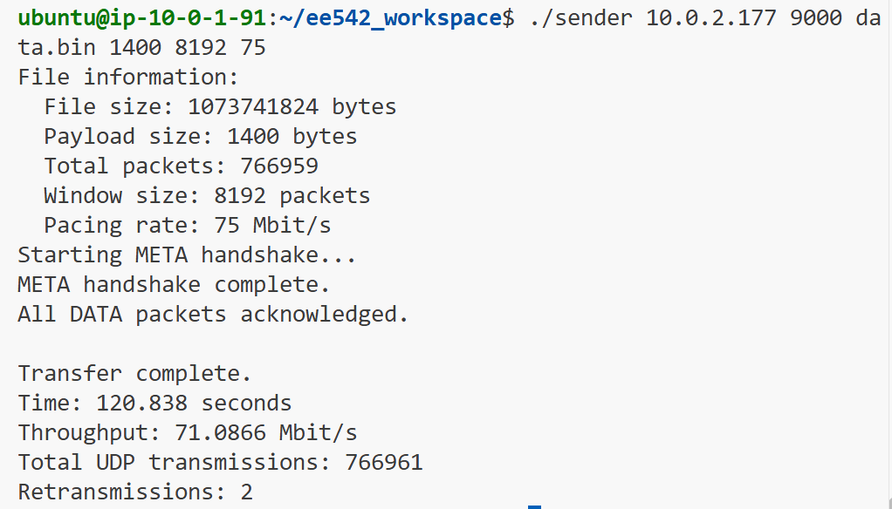

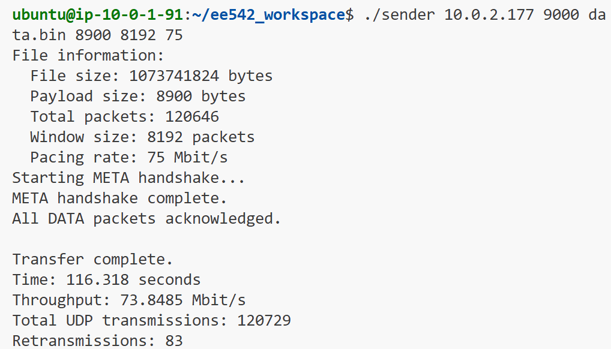

## 3. Comparison with Lab 2

The following table compares reliable-UDP file transfers with the results in the Lab 2 report. Throughput is file goodput, calculated from file size divided by total transfer time.

| Case | MTU | Lab 2 time (s) | AWS time (s) | Lab 2 goodput (Mbit/s) | AWS goodput (Mbit/s) | Goodput change |
|---|---:|---:|---:|---:|---:|---:|
| 1 | 1500 | 97.539 | 97.527 | 88.066 | 88.078 | ~0% |
| 1 | 9001 | 94.692 | 91.288 | 90.714 | 94.097 | +3.7% |
| 2 | 1500 | 170.754 | 152.192 | 50.306 | 56.442 | +12.2% |
| 2 | 9001 | 158.518 | 146.011 | 54.189 | 58.831 | +8.6% |
| 3 | 1500 | 115.597 | 120.838 | 74.309 | 71.087 | −4.3% |
| 3 | 9001 | 111.600 | 116.318 | 76.971 | 73.849 | −4.1% |

AWS performance was similar or better in Case 1, improved by about 9–12% in Case 2, and was about 4% lower in Case 3. MTU 9001 shortened transfer time in every case in both environments. AWS Case 2 retransmissions decreased from 435,200 to 430,572 at MTU 1500 and from 85,230 to 68,045 at MTU 9001. These are individual runs, so the differences cannot be attributed to the platform alone.

Lab 2 verified all received files using MD5. In the provided AWS integrity check, both the original `data.bin` and the received `received.bin` had MD5 `65d30222f2668c9552382240d5c947a5`, confirming that the received file matched the original. The sender results also show that all data packets were acknowledged in every case.

## 4. Conclusion

The Lab 2 file-transfer program ran successfully on AWS and acknowledged all data packets in every case. It sustained 71–94 Mbit/s on the low-loss paths and remained at 56–59 Mbit/s on the high-delay, lossy path, where TCP fell to Kbit/s-level throughput. MTU 9001 generally reduced transfer time, but the benefit depends on the path condition.
# Part 3 — TCP Congestion Control Modification

## 1. Objective

After completing the AWS network experiments and the reliable-UDP file-transfer tests in Parts 1 and 2, the same AWS Client–VyOS–Server topology was reused to study TCP performance over high-latency and lossy links.

The goal of this part was to determine why standard Linux TCP performs poorly when packet loss is caused by an unreliable link rather than actual network congestion, and then modify the Linux TCP stack to improve performance.

Unless otherwise noted, the TCP measurements in this section used:

- **Bottleneck rate:** 100 Mbit/s
- **Client:** `10.0.1.91`
- **Server:** `10.0.2.177`
- **Router:** VyOS
- **Baseline kernel:** Ubuntu 24.04.4, `6.17.0-1017-aws`
- **Modified kernel:** `6.17.0-999-aws`
- **Measurement tool:** `iperf3`

The same static routing and VyOS traffic-shaping configuration described in Part 1 were reused.

---

## 2. Standard TCP Performance

Before modifying the Linux kernel, standard TCP performance was measured over a 100 Mbit/s link under different RTT and packet-loss conditions.

Three groups of measurements were performed:

1. Vary packet loss while keeping RTT low.
2. Vary RTT while keeping packet loss at 0%.
3. Vary packet loss while keeping RTT near 200 ms.

---

### 2.1 Packet Loss with Fixed RTT ≈ 20 ms

RTT was kept near 20 ms while random packet loss was increased in both directions.

| Packet loss per direction | TCP throughput |
|---:|---:|
| 0% | 95.3 Mbit/s |
| 5% | 1.88 Mbit/s |
| 10% | 0.94 Mbit/s |
| 15% | 0.31 Mbit/s |
| 20% | 0.10 Mbit/s |
| 25% | 0.01 Mbit/s |

With no packet loss, standard TCP reached approximately 95 Mbit/s, close to the configured 100 Mbit/s bottleneck rate.

However, even a small amount of random loss caused a severe throughput reduction. At only 5% loss per direction, throughput decreased from 95.3 Mbit/s to 1.88 Mbit/s.

This result shows that standard TCP is highly sensitive to random packet loss even when RTT is relatively small.

---

### 2.2 RTT with Fixed 0% Packet Loss

Packet loss was kept at 0% while RTT was increased from approximately 20 ms to 200 ms.

| RTT | TCP throughput |
|---:|---:|
| 20 ms | 95.3 Mbit/s |
| 40 ms | 93.3 Mbit/s |
| 60 ms | 91.7 Mbit/s |
| 80 ms | 89.4 Mbit/s |
| 100 ms | 86.0 Mbit/s |
| 120 ms | 70.7 Mbit/s |
| 140 ms | 60.5 Mbit/s |
| 160 ms | 51.8 Mbit/s |
| 180 ms | 47.3 Mbit/s |
| 200 ms | 40.4 Mbit/s |

Increasing RTT alone reduced TCP throughput gradually.

Even at approximately 200 ms RTT, TCP still achieved about 40.4 Mbit/s when there was no packet loss.

This indicates that high RTT reduces TCP efficiency, but latency alone does not explain the severe throughput collapse observed in the lossy-link experiments.

---

### 2.3 Packet Loss with Fixed RTT ≈ 200 ms

RTT was then fixed near 200 ms while packet loss was increased.

| Packet loss per direction | TCP throughput |
|---:|---:|
| 0% | 40.4 Mbit/s |
| 5% | 0.308 Mbit/s |
| 10% | 0.103 Mbit/s |
| 15% | 0.0999 Mbit/s |
| 20% | 0.092 Mbit/s |
| 25% | 0.043 Mbit/s |

The combination of high RTT and random loss produced the most severe TCP performance degradation.

At approximately 200 ms RTT:

```text
0% loss  -> 40.4 Mbit/s
5% loss  -> 0.308 Mbit/s
20% loss -> 0.092 Mbit/s
## 3. Custom Linux Kernel Build

To modify the Linux TCP stack, a custom Ubuntu AWS kernel was built and installed on the Client.

The original Client kernel was:

```text
6.17.0-1017-aws
```

The modified kernel was built with a separate ABI:

```text
6.17.0-999-aws
```

Using a separate ABI allowed the original AWS kernel to remain installed as a fallback in case the modified kernel failed to boot.

The modified kernel was verified after reboot with:

```bash
uname -r
```

Expected output:

```text
6.17.0-999-aws
```

The TCP implementation files used in this experiment are located under:

```text
net/ipv4/
```

The two main files modified were:

```text
net/ipv4/tcp_timer.c
net/ipv4/tcp_bbr.c
```

The implementation was completed in two main attempts:

1. Remove exponential retransmission timeout backoff.
2. Preserve a larger BBR congestion window under random link loss.

The corresponding patches are stored in:

```text
kernel_modification/patches/
```

---

## 4. Attempt 1 — Removing Exponential RTO Backoff

### 4.1 Motivation

Standard TCP assumes that packet loss may be caused by network congestion.

When retransmission timeouts occur repeatedly, the retransmission timeout can grow exponentially:

```text
RTO
2 × RTO
4 × RTO
8 × RTO
...
```

This behavior is useful when packet loss is caused by congestion because it reduces the sending rate and prevents congestion collapse.

However, in this experiment, packet loss was intentionally introduced using `tc netem` to represent an unreliable link. Therefore, reducing the sending rate after every timeout may not be the appropriate response.

The first modification followed the idea from *Removing Exponential Back-off from TCP*.

---

### 4.2 Modification

The first modification was made in:

```text
net/ipv4/tcp_timer.c
```

inside the TCP retransmission timeout path.

For established TCP connections, the backoff counter was reset and the RTO was recalculated using the normal RTT-based estimator:

```c
if (sk->sk_state == TCP_ESTABLISHED) {
    icsk->icsk_backoff = 0;
    icsk->icsk_rto = clamp(__tcp_set_rto(tp),
                           tcp_rto_min(sk),
                           tcp_rto_max(sk));
}
```

Conceptually, the timeout behavior changes from:

```text
RTO -> 2RTO -> 4RTO -> 8RTO -> ...
```

to:

```text
RTO -> RTO -> RTO -> RTO -> ...
```

while still using Linux's RTT-based RTO calculation.

The corresponding patch is:

```text
kernel_modification/patches/0001-remove-exponential-rto-backoff.patch
```

---

### 4.3 Result with CUBIC

The modified kernel was first tested using the default CUBIC congestion-control algorithm.

Test condition:

| Parameter | Value |
|---|---:|
| Bottleneck rate | 100 Mbit/s |
| RTT | ≈ 200 ms |
| Random loss | 20% per direction |
| Congestion control | CUBIC |

Observed result:

| Metric | Result |
|---|---:|
| Sender throughput | 17.5 Kbit/s |
| Receiver throughput | 22.5 Kbit/s |
| Retransmissions | 35 |
| Minimum observed congestion window | ≈ 1.41 KB |

The transfer contained many long intervals with:

```text
0.00 bit/s
```

The congestion window eventually decreased to approximately:

```text
1.41 KB
```

which is close to one TCP MSS.

Therefore, removing exponential RTO backoff alone did not improve performance sufficiently.

Although the timeout backoff was removed, CUBIC still reacted to random packet loss by significantly reducing the congestion window.

This suggested that congestion-control behavior was another major bottleneck.

---

## 5. Congestion-Control Comparison

To determine whether a different congestion-control algorithm could perform better under random link loss, several Linux TCP congestion-control modules were tested.

Available algorithms included:

```text
reno
cubic
bbr
westwood
hybla
```

They were loaded using Linux's pluggable congestion-control interface.

For example:

```bash
sudo modprobe tcp_bbr
sudo modprobe tcp_westwood
sudo modprobe tcp_hybla
```

The available algorithms were verified using:

```bash
sysctl net.ipv4.tcp_available_congestion_control
```

Among the tested algorithms, **BBR produced the highest throughput** under the high-delay, high-loss condition.

---

### 5.1 Attempt 1 with BBR

BBR was enabled using:

```bash
sudo sysctl -w net.ipv4.tcp_congestion_control=bbr
```

The same network condition was used:

| Parameter | Value |
|---|---:|
| Bottleneck rate | 100 Mbit/s |
| RTT | ≈ 200 ms |
| Random loss | 20% per direction |
| RTO modification | Exponential backoff removed |
| Congestion control | BBR |

Observed result:

| Metric | Result |
|---|---:|
| Sender throughput | 1.42 Mbit/s |
| Receiver throughput | 1.25 Mbit/s |
| Retransmissions | 1598 |

Compared with the modified CUBIC result:

```text
22.5 Kbit/s
      ↓
1.25 Mbit/s
```

the receiver throughput increased by more than one order of magnitude.

The congestion window also remained much larger than with CUBIC, typically staying in the range of several tens of kilobytes rather than collapsing to approximately one MSS.

This showed that congestion-control behavior was a major factor in addition to retransmission timeout backoff.

However, the transfer still contained many intervals with no useful data transmission.

---

## 6. Attempt 2 — BBR Congestion-Window Floor

### 6.1 Motivation

BBR significantly improved throughput, but the congestion window could still become relatively small during severe random packet loss.

The second modification therefore attempted to preserve a larger amount of data in flight.

For a target throughput of 10 Mbit/s with approximately 200 ms RTT, the bandwidth-delay product is:

```text
10 Mbit/s × 0.2 s = 2 Mbit
```

which is approximately:

```text
250 KB
```

This suggested that maintaining a congestion window of several hundred kilobytes could help prevent excessive link under-utilization.

---

### 6.2 BBR Modification

The second modification was made in:

```text
net/ipv4/tcp_bbr.c
```

A configurable minimum congestion-window value was added:

```c
static unsigned int bbr_lossy_cwnd_floor = 256;

module_param(bbr_lossy_cwnd_floor, uint, 0644);

MODULE_PARM_DESC(
    bbr_lossy_cwnd_floor,
    "Minimum BBR cwnd in packets for EE542 lossy-link experiments"
);
```

During normal BBR operation:

```c
if (bbr->mode != BBR_PROBE_RTT)
    cwnd = max_t(u32, cwnd,
                 READ_ONCE(bbr_lossy_cwnd_floor));
```

The configured value used in the experiment was:

```text
256 MSS
```

Assuming an MSS of approximately 1460 bytes:

```text
256 × 1460 ≈ 374 KB
```

The original BBR `PROBE_RTT` behavior was left unchanged.

The corresponding patch is:

```text
kernel_modification/patches/0002-bbr-lossy-cwnd-floor.patch
```

---

### 6.3 Incremental BBR Module Build

Because BBR is implemented as a loadable Linux kernel module, the second modification did not require rebuilding the complete kernel.

Only:

```text
tcp_bbr.ko
```

was rebuilt.

The module was compiled incrementally using the existing kernel build tree.

The modified module was then loaded into the already-running:

```text
6.17.0-999-aws
```

kernel.

The new runtime parameter was verified using:

```bash
cat /sys/module/tcp_bbr/parameters/bbr_lossy_cwnd_floor
```

Expected output:

```text
256
```

This also allowed the congestion-window floor to be changed at runtime without rebuilding the module again.

---

### 6.4 Attempt 2 Result

The same network condition was used for comparison:

| Parameter | Value |
|---|---:|
| Bottleneck rate | 100 Mbit/s |
| RTT | ≈ 200 ms |
| Random loss | 20% per direction |
| RTO modification | Exponential backoff removed |
| Congestion control | BBR |
| Minimum cwnd | 256 MSS |

Observed result:

| Metric | Result |
|---|---:|
| Sender throughput | 3.15 Mbit/s |
| Receiver throughput | 2.17 Mbit/s |
| Retransmissions | 3626 |
| Typical congestion window | ≈ 362 KB |

The measured congestion window remained close to the configured minimum:

```text
≈ 362 KB
```

which confirmed that the new BBR modification was active.

Receiver throughput increased from:

```text
1.25 Mbit/s
```

with normal BBR to:

```text
2.17 Mbit/s
```

with the BBR congestion-window floor.

This represents approximately a:

```text
74% improvement
```

over the previous BBR result.

However, the transfer still contained repeated zero-throughput intervals followed by short bursts of successful transmission.

Therefore, increasing the congestion window improved throughput but did not fully eliminate the loss-recovery problem.

---

## 7. Modified TCP Results Summary

All measurements in the following table were obtained under approximately:

```text
100 Mbit/s bottleneck
200 ms RTT
20% random packet loss per direction
```

| Configuration | RTO Behavior | Congestion Control | Additional Modification | Sender Throughput | Receiver Throughput |
|---|---|---|---|---:|---:|
| Standard TCP baseline | Default exponential backoff | CUBIC | None | — | 0.092 Mbit/s |
| Attempt 1 | Backoff removed | CUBIC | None | 0.0175 Mbit/s | 0.0225 Mbit/s |
| Attempt 1 + BBR | Backoff removed | BBR | None | 1.42 Mbit/s | 1.25 Mbit/s |
| Attempt 2 | Backoff removed | BBR | 256-MSS cwnd floor | 3.15 Mbit/s | 2.17 Mbit/s |

The optimization process can be summarized as:

```text
Standard TCP + CUBIC
~0.092 Mbit/s
        |
        | Remove exponential RTO backoff
        v
No-backoff + CUBIC
~0.0225 Mbit/s
        |
        | Change congestion control
        v
No-backoff + BBR
~1.25 Mbit/s
        |
        | Add 256-MSS congestion-window floor
        v
Modified BBR
~2.17 Mbit/s
```

---

## 8. Discussion

The experiments show that poor TCP performance over the emulated lossy link is caused by more than one TCP mechanism.

### Effect of RTT

The baseline measurements showed that increasing RTT alone causes a gradual reduction in throughput.

With no packet loss:

```text
20 ms RTT  -> 95.3 Mbit/s
200 ms RTT -> 40.4 Mbit/s
```

Even at approximately 200 ms RTT, standard TCP was still able to achieve significant throughput.

Therefore, high latency alone was not the main cause of the observed TCP collapse.

### Effect of Packet Loss

Random packet loss had a much larger impact.

At approximately 200 ms RTT:

```text
0% loss  -> 40.4 Mbit/s
5% loss  -> 0.308 Mbit/s
20% loss -> 0.092 Mbit/s
```

Only 5% random loss per direction reduced throughput by more than two orders of magnitude.

This indicates that TCP's response to packet loss was the main performance problem in the experiment.

### Effect of Removing Exponential Backoff

Removing exponential RTO backoff reduced the amount of additional waiting introduced after retransmission timeouts.

However, the CUBIC congestion window still collapsed to approximately one MSS.

As a result, removing exponential backoff alone did not improve performance.

### Effect of BBR

Switching from CUBIC to BBR increased receiver throughput from approximately:

```text
0.0225 Mbit/s
```

to:

```text
1.25 Mbit/s
```

This was the largest single improvement observed during the experiments.

The result suggests that the loss-based response used by CUBIC is poorly suited to this controlled lossy-link environment, because random loss does not necessarily indicate network congestion.

### Effect of the BBR Congestion-Window Floor

Adding the 256-MSS congestion-window floor increased receiver throughput further:

```text
1.25 Mbit/s
      ↓
2.17 Mbit/s
```

and kept the congestion window near:

```text
362 KB
```

This confirmed that preserving a larger congestion window improved link utilization.

However, a large number of retransmissions and long zero-throughput periods remained.

Therefore, once the congestion window was sufficiently large, the remaining bottleneck appeared to be TCP retransmission and loss-recovery behavior rather than congestion-window size alone.

---

## 9. Conclusion

This part extended the AWS networking and reliable file-transfer experiments by modifying the Linux TCP implementation itself.

The work included:

- Measuring standard TCP performance across different RTT and packet-loss conditions
- Building and installing a custom Ubuntu AWS kernel
- Preserving the original AWS kernel as a fallback
- Removing exponential RTO backoff for established TCP connections
- Testing multiple Linux congestion-control algorithms
- Identifying BBR as the best-performing available congestion-control algorithm
- Adding a configurable BBR congestion-window floor
- Rebuilding and loading the modified `tcp_bbr.ko` module incrementally
- Comparing the performance of all tested TCP configurations

The baseline measurements demonstrated that random packet loss had a much stronger effect on TCP throughput than RTT alone.

The first modification showed that removing exponential RTO backoff by itself was insufficient because CUBIC still reduced the congestion window aggressively.

Using BBR increased receiver throughput to approximately:

```text
1.25 Mbit/s
```

and the second BBR modification increased it further to approximately:

```text
2.17 Mbit/s
```

under the approximately 200 ms RTT and 20% bidirectional loss condition.

Although the result remained below the final 10 Mbit/s target, the experiments identified the main TCP performance bottlenecks and demonstrated measurable improvements from both congestion-control selection and congestion-window preservation.

The remaining performance limitation appears to be primarily related to retransmission and loss-recovery behavior under severe random packet loss.
